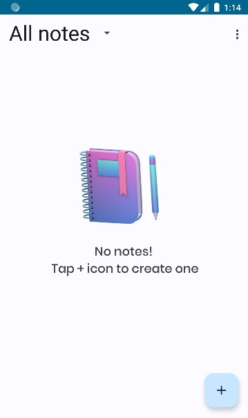

# Joter
Joter is a note making application using kotlin and java, AndroidStudio is the dev environment for this application
This application would eventually allow the users to save their notes locally and later sync their notes and upload them on the
cloud, Firebase in our case. 
Sync is not yet available as Joter is released for testing but all the features would be soon enabled making it worth the usage

### Features

 
- Sync
- Whiteboard
- Voice input typing
- Night theme
- Grid view and list view
- Sorting 

